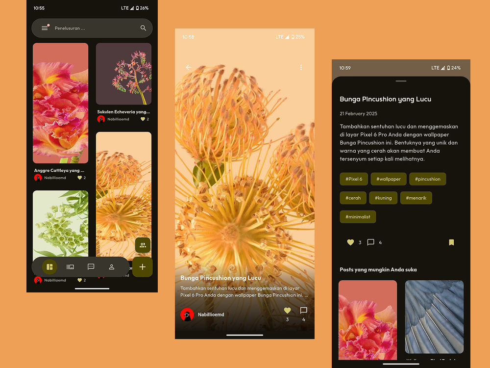

# Chameleon

Chameleon is an open source online gallery app built with Flutter. It is designed to provide users with a seamless and intuitive experience for managing and displaying their photo and video collections.

## Key Features

- **Attractive User Interface:** A modern and responsive user interface for a visually pleasing experience.
- **Easy Media Management:** Easily upload, organize, and delete photos and videos.
- **Albums and Collections:** Organize media into albums and collections for easy browsing.
- **Quick Search:** Quickly find photos and videos using the powerful search feature.
- **Open Source and Customizable:** Customize the app to suit your needs.

## Screenshots

<div style="display: flex; justify-content: space-around;">
  
</div>

## Getting Started

1. **Prerequisites:**

- Flutter SDK installed
- Android Studio or VSCode
- Git

2. **Clone the repository:**

```bash
git clone https://github.com/alfahrelrifananda/chameleon.git
cd chameleon
```

3. **Get dependencies:**

```bash
flutter pub get
```

4. **Run the app:**

```bash
flutter run
```

5. **Change the NDK version in android/app/build.gradle**

```bash
android
    ndkVersion (your NDK version)
```

6. **Create a .env file in the root directory**

```bash
FIREBASE_PROJECT_ID='your-project-id'
FIREBASE_MESSAGING_SENDER_ID='your-messaging-sender-id'
FIREBASE_DATABASE_URL='your-database-url'
FIREBASE_STORAGE_BUCKET='your-storage-bucket'

# Web Platform Options
FIREBASE_WEB_API_KEY='your-web-api-key'
FIREBASE_WEB_APP_ID='your-web-app-id'
FIREBASE_WEB_AUTH_DOMAIN='your-web-auth-domain'
FIREBASE_WEB_MEASUREMENT_ID='your-web-measurement-id'

# Android Platform Options
FIREBASE_ANDROID_API_KEY='your-android-api-key'
FIREBASE_ANDROID_APP_ID='your-android-app-id'

# iOS/macOS Platform Options (They share the same keys/values in your example)
FIREBASE_IOS_MACOS_API_KEY='your-ios-macos-api-key'
FIREBASE_IOS_MACOS_APP_ID='your-ios-macos-app-id'
FIREBASE_IOS_MACOS_ANDROID_CLIENT_ID='your-ios-macos-android-client-id'
FIREBASE_IOS_MACOS_IOS_CLIENT_ID='your-ios-macos-ios-client-id'
FIREBASE_IOS_MACOS_BUNDLE_ID='your-ios-macos-bundle-id'

# Windows Platform Options
FIREBASE_WINDOWS_API_KEY='your-windows-api-key'
FIREBASE_WINDOWS_APP_ID='your-windows-app-id'
FIREBASE_WINDOWS_AUTH_DOMAIN='your-windows-auth-domain'
FIREBASE_WINDOWS_MEASUREMENT_ID='your-windows-measurement-id'    
```

## Contributions

We welcome contributions from the community. If you would like to contribute to Chameleon, please follow these steps:

1. Fork the repository.
2. Create your feature branch (`git checkout -b feature/new-feature`).
3. Commit your changes (`git commit -am 'Add new feature'`).
4. Push to the branch (`git push origin feature/new-feature`).
5. Create a new Pull Request.

## Support

If you have any questions or concerns, please open an issue on GitHub.
